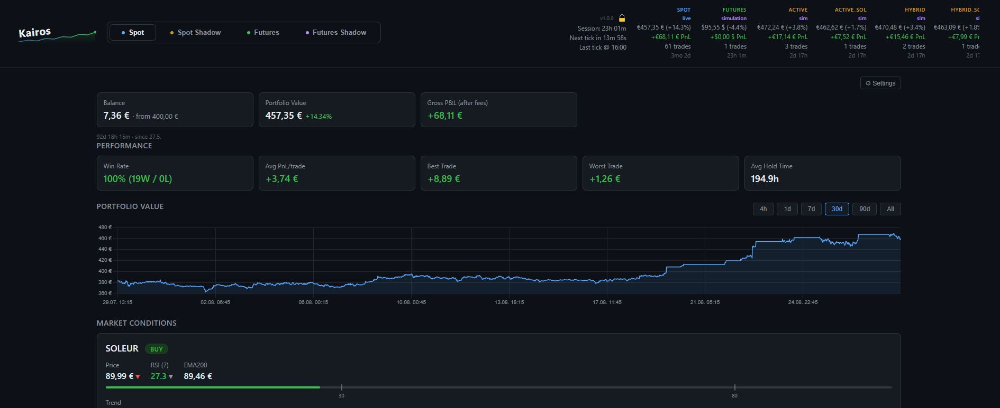
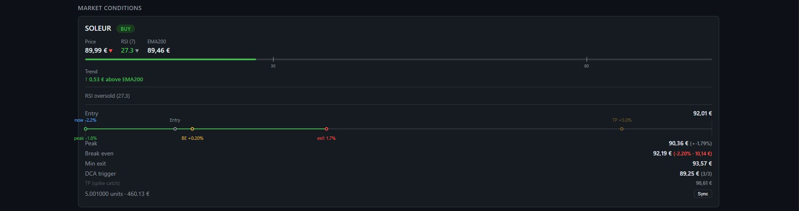
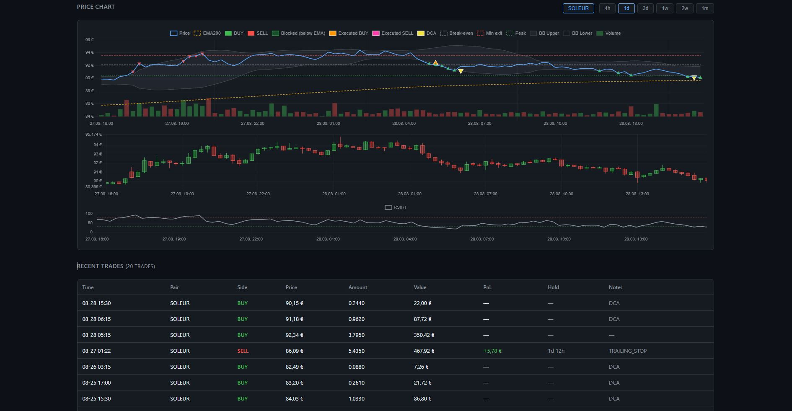
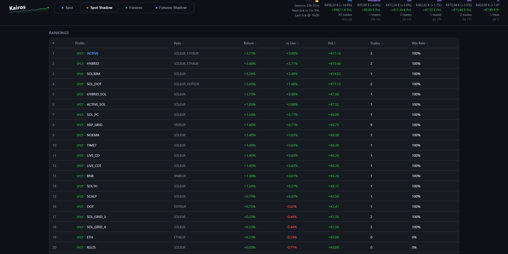

# Kairos

A self-hosted crypto trading bot for Binance with a web dashboard. Runs two independent engines simultaneously:

- **Spot** — any Binance quote currency (SOLEUR, ETHUSDT, XRPGBP, …), 15m candles, RSI + EMA200 mean-reversion
- **Futures** — USDT-M perpetuals (ETHUSDT, SOLUSDT), 15m candles, isolated margin, configurable leverage

Simulation mode requires no API keys — paper trade first, switch to live when ready.

## Features

- **RSI + EMA200 signal** — buys oversold dips above the long-term trend; exits via trailing stop or take-profit
- **DCA** — averages down in up to N tranches as price falls further from entry
- **Trailing stop** with a profit floor — rises with price, only fires once in profit
- **Partial close** — optionally banks a fraction at take-profit and trails the rest
- **Shadow simulators** — run multiple parameter sets as paper trades alongside the live bot, same candle feed
- **Fast stop-check loop** — re-checks stops every 30s between 15m candles
- **Web dashboard** — live P&L, open positions, price charts, balance history, tax estimate
- **Discord integration** — trade alerts, tick embeds, slash commands
- **Backtest + parameter sweep** — replay historical candles for spot, futures, and grid strategies; sweep RSI/trail/DCA/leverage params; rank shadow profiles by return; `pair_sweep.py` for single-pair deep sweeps

## Quick start

```bash
# 1. Install dependencies
python3 -m venv .venv
.venv/bin/pip install -r requirements.txt

# 2. Configure
cp .env.example .env
# Set SPOT_TRADING_PAIRS and leave SPOT_MODE=simulation

# 3. Run
./start.sh
# Dashboard: http://<your-ip>:8888

# 4. Watch logs
tail -f data/kairos.log       # trading engine
tail -f data/dashboard.log    # web dashboard
```

First candle tick fires within 15 minutes. When you're happy with simulation results, set `SPOT_MODE=live` in `.env`, add your Binance API keys, and restart.

## Going live

1. Binance → API Management → Create API → enable **Reading** + **Spot & Margin Trading** only (no withdrawals)
2. Restrict to your server's IP
3. Add `BINANCE_API_KEY` and `BINANCE_SECRET_KEY` to `.env`
4. Set `SPOT_MODE=live` and restart

## Requirements

- Python 3.10+
- `flask`, `python-binance`, `pandas`, `python-dotenv`, `requests`, `discord.py`
- Linux — the start/stop/watchdog scripts are bash. Windows is not currently supported.
- Any Binance quote currency — set `SPOT_QUOTE_CURRENCY` to match the suffix of your pairs (EUR, GBP, USDT, USDC, BRL, TRY, AUD, BNB, …)

## Screenshots









## Documentation

See [REFERENCE.md](REFERENCE.md) for the full configuration reference, per-pair overrides, shadow profile setup, backtest usage, and project layout.


## Support

Kairos is free and open source. If it's been useful to you, tips are appreciated but never expected.

| Coin | Address |
|------|---------|
| BTC | `bc1qasr52a27ejdyjyv2qya9ms9gzyd3vhc8tq66lu` |
| ETH | `0x1d54dd5A208311935D9297dBDbbD4813F25394Da` |
| SOL | `3WTsRikq7PBxW4Ys9xBDAQS1djqfjhJnije69n5opRB2` |
